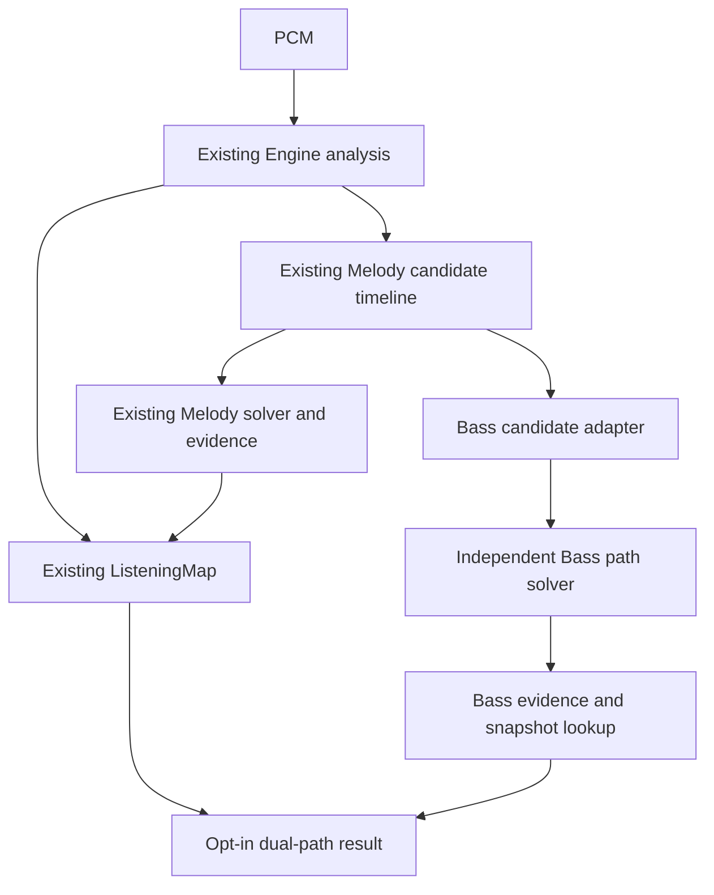

# Computational Listening Engine v0.3 — Dual-Path Listening v0.1

Status: **architecture starter**. This is a two-path design for a Melody Path and a Bass Path. It is not polyphonic listening, voice separation, source assignment, arbitrary multi-note tracking, note segmentation for bass, or a tuned bass recognizer.



In the current implementation the Engine builds candidates and Melody evidence exactly as before. The Bass adapter reads that retained candidate timeline afterward, then runs a separate path objective. The diagram shows **shared candidate provenance**, not concurrent execution. Melody results do not depend on any bass decision. `analyzePcmListening` and `analyzePcmListeningAsync` continue to produce their existing maps; `analyzeDualPathListening` is the opt-in entry point.

## Folder structure

```text
src/
  bass/
    types.ts               BassCandidate, BassPath, BassEvidence, BassSnapshot,
                           BassEvaluation, BassDataset contracts
    candidates.ts          Candidate adapter from existing compact evidence
    solver.ts              One-path dynamic program with an abstain state
    BassAnalysis.ts        Evidence construction and frame snapshot lookup
    DualPathListening.ts   Opt-in PCM integration
    index.ts               Bass exports
  analysis/MelodyAnalysis.ts             unchanged
  melody-evidence/                    unchanged
  analysis/AudioAnalysis.ts            unchanged
tests/
  BassPath.test.ts          Solver, candidate reuse, determinism, and compatibility
```

There is **one** bass state (or abstention) per existing analysis frame. `BassPath.selectedCandidateIndexes` refers to each frame's own `BassCandidate[]`. `BassEvidence` retains the candidate alternatives, the selected state, raw candidate score, and whether a frame had no candidates or the path abstained. `BassSnapshot` is a frame lookup into that evidence. It has no note or calibrated confidence claim.

## Starter objective and boundaries

The Bass solver maximizes a deterministic path objective. A candidate's local evidence score is combined with its **relative low-register order within the available frame**, and transitions pay for pitch jumps, octave jumps, and starting or stopping. A null state allows abstention. This is structurally different from taking the strongest or highest-scoring pitch independently in each frame. The objective constants in `BASS_PATH_OBJECTIVE` are initial architectural values; no parameter sweep, benchmark tuning, or DSP modification has been performed.

The adapter reads at most the already retained Melody candidates (five usable candidates and up to three retained range rejections per frame). It keeps usable candidates at or below **330 Hz** and below-Melody-range rejected candidates. The upstream YIN search has a nominal **80 Hz** lower bound; this architecture does not extend it. Candidate scores are existing support values, **not calibrated probabilities**. The bass solver does not read Melody's selected path, final confidence, notes, or track availability. It does read the same compact evidence storage that preserves candidate pitch and support.

This constraint is significant: a high isolated tone can generate lower harmonic/subharmonic candidates inside the bass scope. In a focused 880 Hz test, the Bass Path selects a false lower candidate. The architecture exposes that failure; it does not correct or hide it. A low bass line can also be absent from Melody's capped candidate pool. Do not interpret the output as reliable source separation or as proof that a bass instrument exists.

## Public API

The Engine root exports the following new symbols:

| Symbol | Purpose |
| --- | --- |
| `analyzeDualPathListening(pcm)` | Opt-in call returning `{ listeningMap, bassEvidence }`. The map is the existing Engine result. |
| `analyzeBassFromMelodyEvidence(timeline)` | Run only the Bass Path from an existing candidate timeline. |
| `bassCandidatesFromMelodyEvidence(timeline)` | Inspect the adapted candidate frames. |
| `solveBassPath(frames)` | Solve an independent sequence of candidate frames; useful for controlled tests and future adapters. |
| `lookupBassSnapshot(evidence, time)` | Return the latest frame decision at the supplied time. |
| `BASS_PATH_OBJECTIVE` | Immutable starter objective constants for reproducibility. |
| `BassCandidate`, `BassCandidateFrame`, `BassPath`, `BassEvidence`, `BassEvidenceFrame`, `BassSnapshot`, `DualPathListening` | Current data types. |
| `BassEvaluation`, `BassDataset` | Future type contracts only. No evaluator or real bass dataset is implemented. |

`BassEvidence` and `BassSnapshot` are independent of the existing `ListeningMap`, `ListeningSnapshot`, capability flags, and timeline events. This keeps existing consumers and Melody behavior stable while establishing the second path. There is no API that lets Bass change Harmony, Rhythm, or Melody outputs.

## Remaining TODOs

1. Produce independently annotated bass ground truth and source-group splits using the existing [dataset specification](../datasets/DATASET_SPECIFICATION_V0.1.md). The `BassDataset` type is a proposed contract, not a shipped dataset.
2. Implement Bass evaluation **separately**, using held-out reference pitch and temporal continuity. `BassEvaluation` currently names an eventual result shape; no metric is computed or reported.
3. Resolve harmonic/subharmonic ambiguity and test bass presence versus high-only material. Do this after datasets exist, with explicit evaluation; the current starter objective is not validated for accuracy.
4. Decide whether a future candidate generator should cover bass below 80 Hz and retain more alternatives without changing Melody results. No such generator exists in this version.
5. Define bass note boundaries, track availability, and event semantics only if a later milestone needs them. Frame snapshots do not imply notes.
6. Define rolling/streaming time shifts for Bass evidence if the opt-in path is added to rolling sessions. No streaming integration is claimed here.
7. Version objective and data contracts if future benchmark work changes their meaning. Report the Engine build, candidate source, objective constants, and dataset version for reproducibility.

Existing Melody analysis and evidence, Harmony, Rhythm, Confidence, Zoë, and Z.land remain outside this change. No benchmark tuning is performed.
